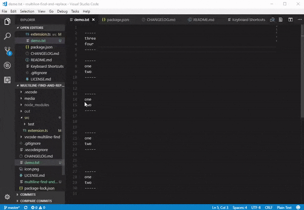
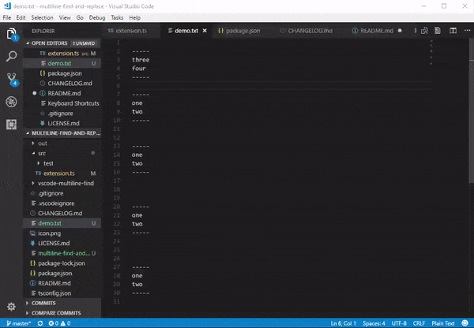

# vscode-multiline-find
Multiline find and replace extension for Visual Studio Code

This allows for quick multiline find and replace. It uses selections from a document to set the find and replace strings and does not have any dedicated GUI.

In addition to the functionality above the `copyAsRegex` command can be used to copy text for use in the normal find/replace widget with regex enabled.

# Development History

There are a few aproaches one could take to add this functionality. In order of simplest to most complicated:

1. Add a new command set to support all the find and replace operations in parallel to the normal VSCode find/replace exept it allows multiple lines and has no GUI.
2. Add a command to translate multiline selections to a sanitized regular expresion that fill in the standard find widget using `actions.findWithSelection` and `toggleFindRegex` (Can't autofill replace would probably need mechanism to add regexed selection to copy buffer). This has the disadvantage that it would likely interfere with the document history or the copy buffer, or cause some jumpy action as the selection changes.
3. Option 1, but also build a GUI by openning a new editor window for the find and replace options.

I initially went with aproach 2 and was able to basically get things working. I could copy multiline segments as a regex and send them to the find widget. I hit an unexpected issue in that `ctrl+f` with selected text when the regex toggle escapes special characters. Therefore I couldn't pass in \n. Since you can't detect the regex enable state and you can only toggle it, this makes this method pretty useless. I could do some crazy seqence to try to determine the regex enable state by running findNext and seeing how the selection changes, but I decided this was too hacky. I decided to go back with option 1 and finish out the basic functionality.

Once I got the basics working I explored the options for giving a dedicated editor for the find and replace strings. There was no easy path to get the multiline persistent input elements I wanted (See discussion in https://stackoverflow.com/questions/45394095/can-textdocumentcontentprovider-html-jscontent-talk-to-an-the-extensions-code) so I decided to publish the basic functionality. I could build a `TextDocumentContentProvider` along with a websocket for feedback, but this would be a more extensive project then I had time for.